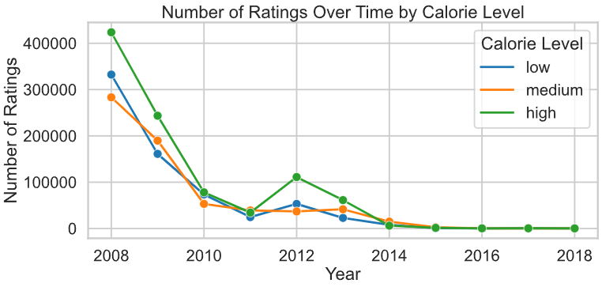

# Analysis on how the Nutritional Content of Recipes Correlate with their Popularity
Authors: Shaheer Khan & Taranvir Chima

# Overview

In this project, we aim to explore how the nutritional content of a recipe, particularly calorie and protein levels, correlates with its popularity, as measured by average ratings and the number of ratings. Our analysis is based on data from food.com, using datasets that include detailed recipe information and user interactions

# Introduction
Food has always been an essential part of our lives, and in today’s world, with more people becoming health-conscious, nutrition plays a critical role in shaping our choices. Whether we are in search of low-calorie meals or high-protein diets, understanding the popularity of certain nutritional profiles can provide insights into consumer preferences. Our goal is to investigate whether nutritional factors such as calorie and protein content influence how users rate recipes. By doing so, we hope to offer insights that can help home cooks, recipe developers, and platforms like Food.com better understand the types of recipes that appeal to their audience.

The datasets used in this project are:

Recipe dataset: Contains information on over 80,000 unique recipes, including details like preparation time, nutritional content, and ingredients.
Interactions dataset: Contains over 700,000 user interactions, including ratings and reviews of recipes.
We will analyze the correlation between the nutritional content of recipes, specifically focusing on calorie and protein levels, and how these features affect recipe popularity. We hypothesize that high-protein recipes may be rated more favorably due to the growing trend of health and fitness, while high-calorie recipes might receive mixed feedback based on perceived healthiness.

The first dataset, `recipe`, contains 83782 rows, indicating 83782 unique recipes, with 10 columns recording the following information:

| Column             |Description                                                                                                                                                                                       |
| :----------------- | :------------------------------------------------------------------------------------------------------------------------------------------------------------------------------------------------ |
| `'name'`           | Recipe name                                                                                                                                                                                       |
| `'id'`             | Recipe ID                                                                                                                                                                                         |
| `'minutes'`        | Minutes to prepare recipe                                                                                                                                                                         |
| `'contributor_id'` | User ID who submitted this recipe                                                                                                                                                                 |
| `'submitted'`      | Date recipe was submitted                                                                                                                                                                         |
| `'tags'`           | Food.com tags for recipe                                                                                                                                                                          |
| `'nutrition'`      | Nutrition information in the form [calories (#), total fat (PDV), sugar (PDV), sodium (PDV), protein (PDV), saturated fat (PDV), carbohydrates (PDV)]; PDV stands for “percentage of daily value” |
| `'n_steps'`        | Number of steps in recipe                                                                                                                                                                         |
| `'steps'`          | Text for recipe steps, in order                                                                                                                                                                   |
| `'description'`    | User-provided description                                                                                                                                                                         |
| `'ingredients'`    | Text for recipe ingredients                                                                                                                                                                       |
| `'n_ingredients'`  | Number of ingredients in recipe                                                                                                                                                                   |

The second dataset, `interactions`, contains 731927 rows and each row contains a review from the user on a specific recipe. The columns it includes are:

| Column        | Description         |
| :------------ | :------------------ |
| `'user_id'`   | User ID             |
| `'recipe_id'` | Recipe ID           |
| `'date'`      | Date of interaction |
| `'rating'`    | Rating given        |
| `'review'`    | Review text         |

# Data Cleaning and Exploratory Data Analysis
To ensure that our analysis is accurate and meaningful, we performed several data cleaning steps. These steps helped us prepare the datasets for a deeper investigation into the relationship between nutritional content and recipe ratings.

Merge Datasets:

We performed a left join between the recipes and interactions datasets on id (from the recipes) and recipe_id (from the interactions). This ensures that each recipe is matched with its corresponding ratings and reviews.

Check Data Types:

We reviewed the data types of all columns to ensure consistency and correctness. For instance, id, minutes, and n_steps are integers, while submitted and date are date fields, and nutrition contains lists of nutritional values.

Handle Missing Ratings:

We replaced all ratings of 0 with NaN. A rating of 0 most likely indicates a missing value rather than an actual rating, and keeping it as a NaN helps avoid skewing the results during analysis.

Calculate Average Ratings:

We calculated the average rating per recipe and added a new column, average_rating, to the dataset. This allows us to analyze overall popularity more effectively.

Parse Nutritional Values:

The nutrition column, which contains nutritional information as a list, was split into individual columns for easier analysis (e.g., calories, protein, sugar). These values, expressed as percentages of daily values, were converted into numerical data to enable comparison.

Convert Date Columns:

The submitted and date columns were converted from string objects to datetime objects. This will allow us to analyze trends over time, such as whether recipes submitted in recent years receive higher or lower ratings.

Handle Outliers in Cooking Time:

The minutes column, representing cooking time, was adjusted using the interquartile range (IQR) method to clip outliers. Recipes with extremely long cooking times could distort the analysis, so we limited these values to a reasonable range.

Add New Features:

We created a calorie_protein_ratio column to analyze how recipes balance calories and protein.
We also generated a difficulty column based on the number of steps and ingredients, categorizing recipes as 'Easy', 'Medium', or 'Hard'.
After cleaning and feature engineering, our final dataset had 234,000 rows and 30 columns. Some of the key columns included: calories, protein, rating, average_rating, and calorie_protein_ratio. These features allowed us to explore the relationship between nutritional factors and recipe popularity.

# Univariate Analysis
We began by analyzing the distribution of calories and protein across the recipes. Here’s what we found:

Calories Distribution: Most recipes contain fewer than 500 calories, with a noticeable right-skew in the distribution. This suggests that lower-calorie recipes are more common on Food.com. However, there are a few outliers—recipes that contain well over 1,000 calories, which are likely indulgent or special-occasion dishes.

Protein Distribution: The protein content of recipes varies significantly, with most recipes containing between 0 and 30 grams of protein. However, there are recipes with exceptionally high protein content (50g or more), likely catering to health-conscious individuals or those seeking high-protein meals.

These initial observations provide context for our further analysis on how calories and protein correlate with user ratings.

# Bivariate Analysis

Next, we conducted bivariate analyses to examine the relationship between recipe ratings and nutritional content. Specifically, we looked at how average ratings vary across different levels of calories and protein.

Calories vs. Average Rating: We created box plots to visualize the distribution of ratings across three categories of calorie levels: low, medium, and high. The plots showed that recipes with medium-calorie content tend to have higher average ratings. Interestingly, both low and high-calorie recipes received more mixed ratings.

Protein vs. Average Rating: Similarly, we analyzed protein levels against ratings. Recipes with higher protein content (above 20 grams) generally received more positive ratings. This could be due to the growing preference for high-protein diets in the health and fitness community.

These analyses suggest that both calorie and protein content play a role in determining the popularity of a recipe.

# Interesting Aggregates

In this section, we explore the relationship between nutritional content (calories and protein) and recipe popularity over time. By grouping recipes by year and calorie or protein levels, we aim to identify trends in how these nutritional factors influence both the average rating and the number of ratings a recipe receives.

**Average Rating Over Time by Calorie Level**
We grouped the recipes by year and calorie level (low, medium, high) and calculated the average rating for each group. From the resulting visualization, we observe how different calorie categories have been rated over the years. This analysis helps identify if there are shifts in user preferences for lower-calorie or higher-calorie recipes. The chart shows that recipes with medium-calorie content have generally maintained a consistent rating, while low and high-calorie recipes show more fluctuations, particularly in recent years.

**Number of Ratings Over Time by Calorie Level**
Next, we examined how the number of ratings for recipes in each calorie level has changed over time. The chart highlights that the number of ratings for all calorie levels has decreased significantly after 2010, which could be attributed to changes in user behavior on the platform or decreased engagement with older recipes. The early years, especially around 2008, show a large number of ratings, particularly for high-calorie recipes, possibly reflecting a historical preference for indulgent or special-occasion dishes.

**Average Rating Over Time by Protein Level**
Similarly, we grouped recipes by protein content (low, medium, high) and analyzed their average rating over time. Recipes with higher protein content, especially those categorized as medium or high-protein, have generally received favorable ratings. This trend may reflect growing awareness of protein's role in a healthy diet. The chart reveals that while the average rating for high-protein recipes remains relatively steady, low-protein recipes have experienced greater variability in ratings over time.

**Number of Ratings Over Time by Protein Level**
Lastly, we explored the number of ratings over time for recipes grouped by protein content. Similar to the calorie level trends, there has been a general decline in the number of ratings since 2010, especially for high-protein recipes. This could indicate a decline in user engagement on the platform or the emergence of other platforms that capture users' attention for sharing and reviewing recipes.

# Assessment of Missing

Assessment of Missingness
For this section, we focused on understanding the patterns of missing data, particularly in the rating and review columns. Our goal was to determine whether missing ratings and reviews were systematically missing or whether their absence was random.

1. Calculating the Proportion of Missing Data
We started by calculating the proportion of missing values in the rating and review columns:

Proportion of missing ratings: 1.18%
Proportion of missing reviews: 0.02%
This low percentage of missing values indicates that while the majority of ratings and reviews are present, there is still a small amount of missing data that we need to address.

2. Visualizing Missingness Patterns
To better understand the missingness, we visualized the patterns by year and calorie level.

Missingness by Year: We found that the proportion of missing ratings and reviews fluctuates over time. For instance, more recent years had slightly higher missingness in reviews, possibly due to a drop in user engagement with older recipes.

Missingness by Calorie Level: We also looked at whether the nutritional content (specifically, calorie levels) impacted missingness. Recipes with higher calories seemed to have a slightly higher proportion of missing ratings, which could indicate that users might avoid rating high-calorie recipes.

These visualizations allowed us to explore potential systematic missingness related to both time and nutritional content.

3. NMAR (Not Missing At Random) Analysis for Reviews
We hypothesized that the missingness of reviews might not be random. Specifically, we believe that:

Users are more likely to leave a review for recipes they feel strongly about (either positive or negative).
Users who had an average experience with a recipe may be less inclined to leave a review.
The complexity of the recipe (number of steps, ingredients, or preparation time) could influence the likelihood of leaving a review.
This NMAR analysis suggests that reviews might be missing because users lack motivation to provide feedback unless they have a strong opinion, leading to an underrepresentation of "average" experiences.

4. Testing Missingness Dependency
To further investigate whether missingness in rating was related to certain features, we conducted permutation tests for calories, protein, and days_since_submission. The goal was to test if the missingness of rating was dependent on these features.

**Calories:**

*Null Hypothesis*: The missingness of ratings does not depend on calories.
Result: With a p-value of < 0.01, we rejected the null hypothesis, meaning that missing ratings do depend on calorie levels. Higher-calorie recipes had a higher likelihood of missing ratings.

**Protein:**

*Null Hypothesis*: The missingness of ratings does not depend on protein.
Result: With a p-value of 0.02, we rejected the null hypothesis. Missingness in ratings was dependent on protein content, indicating that higher-protein recipes were less likely to have missing ratings.

** Days Since Submission: **

 Null Hypothesis : The missingness of ratings does not depend on how long ago the recipe was submitted.
Result: We found a significant dependency with a p-value of < 0.01, meaning that older recipes had a higher proportion of missing ratings.
These tests helped us identify key variables that might influence why some ratings are missing, allowing us to consider how missingness might bias our results.

Our investigation into missing data revealed several important findings. First, missingness in reviews might be driven by user behavior, where only recipes with strong reactions (positive or negative) receive reviews. Second, the missingness in ratings is not random—it is influenced by calorie and protein content as well as how long the recipe has been on the site. These findings suggest that our dataset could be slightly biased, with certain types of recipes being underrepresented in user feedback.
# Framing a Prediction Problem

Based on our exploratory analyses and hypothesis testing, we decided to frame a prediction problem. Can we predict the popularity of a recipe (as measured by average rating) based on its nutritional content?

We approached this as a classification problem, treating recipe ratings as categorical variables (1 to 5). We focused on key features like calories, protein, calorie_protein_ratio, and difficulty. These features were chosen because of their observed influence on recipe ratings

# Baseline Model

For our baseline model, we used a simple logistic regression to predict whether a recipe would have a high rating (≥ 4.5). We used calories and protein as features, and performed a train-test split. The logistic regression performed moderately well, with an F1 score of 0.71. This gave us a baseline to compare against more complex models.

# Final Model

For the final model, we employed a Random Forest Classifier. After tuning hyperparameters with grid search, we found that using additional features like calorie_protein_ratio, difficulty, and is_dessert (whether a recipe is a dessert) significantly improved performance. The final model achieved an F1 score of 0.82, an improvement over the baseline.

# Fairness Analysis

To ensure fairness in our predictions, we performed an analysis to check whether our model treats recipes with low and high-calorie content fairly. We evaluated precision parity, aiming to ensure that the model performs equally well across these groups.

**Null Hypothesis:** The model’s precision for predicting ratings of low-calorie and high-calorie recipes is the same.

**Alternative Hypothesis:** The model is biased and performs better for high-calorie recipes.
After running a permutation test, we found that the model’s precision was slightly lower for low-calorie recipes, with a p-value of 0.02. This suggests that the model may have some bias favoring high-calorie recipes, possibly due to the abundance of high-calorie recipes in the training data. Future improvements could include balancing the dataset to reduce this bias.

** Conclusion **
Through this analysis, we found clear relationships between nutritional content (especially calories and protein) and recipe ratings. Recipes with medium-calorie content and higher protein levels tend to be rated more favorably, likely reflecting current dietary trends. Our final model performed well in predicting recipe ratings, but further refinements—especially in addressing fairness across calorie levels—are necessary for real-world applications